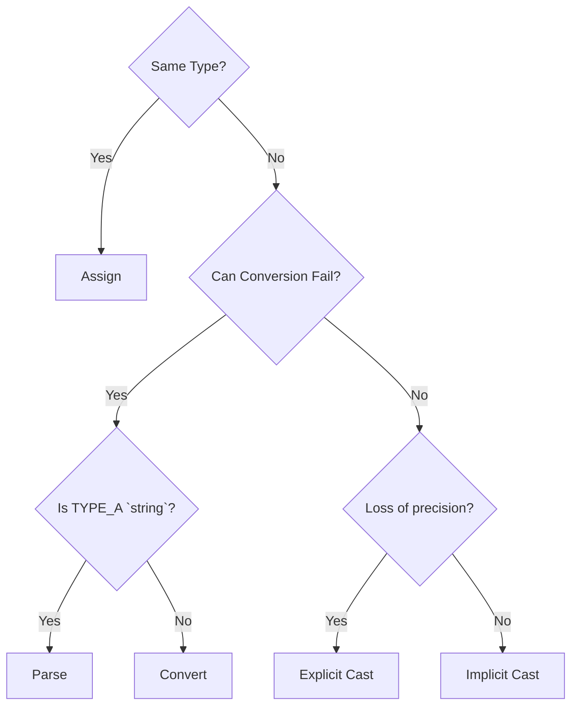

# Slides 8 - Conversion

Variables have a certain type which cannot change.
- This is, what makes C# Type-Safe:

```cs
int age = 5;
age = "Marc"; // ERROR
```

## Implicit Casting
But: Some types can be cast implicitly.
- This means that you just assign it to a variable of another type.

```cs
int number = 5;
float fractionalNumber = number; // Value: 5.0f
```

This works, if the conversion can happen without losing any information.

## Explicit Casting
Some can only be cast explicitly.
- The reason is that for example converting a fractional number to a whole number comes with a loss of precision:

```cs
float decimalNumber = 9.78;
int number = (int) decimalNumber; // new value: 9
```

## Conversion
Some need to be explicitly converted.
- Conversions are validated and will throw exceptions if invalid
- e.g if the string is "Tom", which is not a number.
```cs
string input = "2";
int i = Convert.ToInt32(input); // New value: 2
```

```cs
string input = "2,3";
double d = Convert.ToDouble(input); // New Value: 2.3
```

```cs
string input = "Marc";
int i = Convert.ToInt32(input); // EXCEPTION (ERROR)
```

## Parsing
Parsing describes a special conversion
- in which the input is a `string`

Instead of writing
```cs
string input = "22";
int number = Convert.ToInt32(input);
```

You can then write
```cs
int number = int.Parse(input);
```

### Culture Info

- Warning: Parsing numbers is dependant on your system's Regional Settings.
- In Sweden and Germany, for example, Decimal numbers are written `2,3` instead of `2.3`.
- If you try converting a number in the wrong format, you will see this error instead:

`Unhandled exception. System.FormatException: Input string was not in the correct format.`

To always convert numbers using the Internal Standard Notation (`2.3`), use this instead:
```cs
int number = int.Parse(input, CultureInfo.InvariantCulture)
```

Or you can configure it for all upcoming Parses:

```cs
Thread.CurrentThread.CurrentCulture = CultureInfo.InvariantCulture;
```

## Summary

If you want to do this assignment:

```cs
TYPE_A a;
TYPE_B b = a;
```



Or Brute Force it:
- Try assigning it. If it gives an error, then...
- Try casting it explicitly. If it gives an error, then...
- Try parsing it. If it gives an error, then...
- Try converting it.


Conversions are often necessary while computing.
- For example
  - you want to ask the user, how many items he wants to buy
  - but `Console.ReadLine()` always returns a `string`
  - you can use `int.Parse(userInput)` to convert the text to a number
- There‘s a variety of ways of doing that, you should always choose the easiest path that‘s available for your conversion
